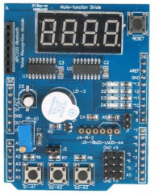

# Multi Functional shield and Ultrasonic sensor HC-SR04

Display measurement from  HC-SR04 ultrasonic sensor on Multifunctional Shield 's &segment display
With Buttons you can:

 -  show last measure
 -  show measure in centimeters
 -  show measure in inches

[Youtube Demo](https://youtube.com/shorts/)

[Tinkercad Simulation](https://www.tinkercad.com/things/k5WkkFn6tJT-multi-functional-shield-and-ultrasonic-hc-sr04)

## About Multi Functonal Shield

Multi Functonal Shield (MFS) contain several undependent input and output devices

 - LEDs
 - 7-segment display with 74hc595 driver
 - Buttons
 - Potentiometer
 - Pins for Servo
 - slot for analog sensor (lm35)
 - slot for digital sensor (18b20)
 - slot for blutooth (TxD, RxD lines and +5V pover)
 - buzzer (active or passive)

Shield schema below

## Useful links

[Complete guide to ultrasonic sensor HC-SR04](https://randomnerdtutorials.com/complete-guide-for-ultrasonic-sensor-hc-sr04/)

[Library for multiple HC-SR04](https://github.com/d03n3rfr1tz3/HC-SR04)
