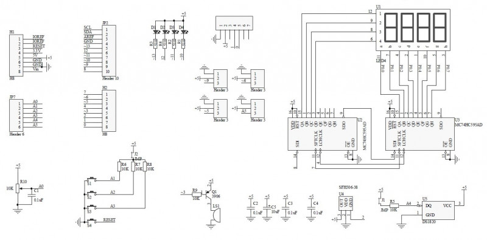

#Serial console for Multi Functonal Shield 


## About Multi Functonal Shield


Multi Functonal Shield (MFS) contain several undependent input and output devices

 - LEDs
 - 7-segment display with 74hc595 driver
 - Buttons
 - Potentiometer
 - Pins for Servo
 - slot for analog sensor (lm35)
 - slot for digital sensor (18b20)
 - slot for blutooth (TxD, RxD lines and +5V pover)
 - buzzer (active or passive)

Shield schema below


## How to use

minicom
```bash
minicom -b 115200 -D /dev/ttyUSB0
```

Screen
```bash
screen /dev/ttyUSB0 115200
```

To reset access to ttyUSB0
```
fuser -k /dev/ttyUSB0
```

##Commands
There are two command structures

2 letters command structure:

`<IO Device><Action>`

Devices:

 - **D** - Display
 - **L** - Leds
 - **M** - buzzer (active or pasive)

Actions:

 - **?** - Print help, can be used without letter
 - **!** - Run test
 - **%** - Reset for LEDs and Display it turn them off

More then 3 leters

`<IO Device><Details>:<Value>`

Detalis depends on device. See below

### Mode
It can be used for control board devices in interactive via TTY app.

`@D` - [default] *'Device mode'* If your app wait when you enter whole command and then send it. Display shut down while arduino receive whole command.

`@M` - *'Manual mode'*, use it if your device send each character you type.

WARNING: Backspase, Del and Cursor movements do not processed.

### LEDS
`L<led_number 0-4>:<STATE>` - Set state for LED. 0 - LED will be OFF, 1 - LED will be ON

`L<led_number 0-4>` -  get state of LEDs

### Display
 Details is number format to show on display

  Formats:

  - **D** - unsinged decimal, Use digit 0-9, max value 9999
  - **S** - signed decimal byte, for 1 byte signed values, (negative values will be show if income value is bigger than 127)
  - **H** - unsigned hexadecimal, user symbols 0 - 9, A - F, max value 65535

For income values use decimal format, for **S** you can use `-`

Examples

```
dd:234
// Display show | |2|3|4|

dh:257
// Display show | | |F|F|

ds:130
ds:-3
// Display show `|-| | |3|`

dd:12345
// Value is over 9999. Display show |-|-|-|-|
```

### Melody

It is no detalis for melody for now. Single M or with any other symbols let you play melody from arduino examples

## See also
[Hacatronicks afout MFS](https://www.cohesivecomputing.co.uk/hackatronics/arduino-multi-function-shield/)