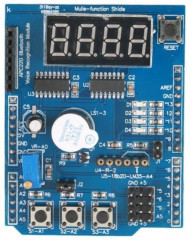
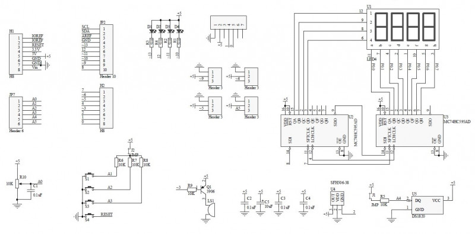

# Multi Functional shield Buttons

Control Multifunctional Shield with buttons

 - LEDs test: on and off LEDs
 - Display test: Runimg segments
 - Random number on Display

[Youtube Demo](https://youtube.com/shorts/hOFhQ7bvLTQ)

[Tinkercad Simulation](https://www.tinkercad.com/things/2toP4bNdBqG-mfun-sield-display-and-buttons)

## About Multi Functonal Shield

Multi Functonal Shield (MFS) contain several undependent input and output devices

 - LEDs
 - 7-segment display with 74hc595 driver
 - Buttons
 - Potentiometer
 - Pins for Servo
 - slot for analog sensor (lm35)
 - slot for digital sensor (18b20)
 - slot for blutooth (TxD, RxD lines and +5V pover)
 - buzzer (active or passive)

Shield schema below

